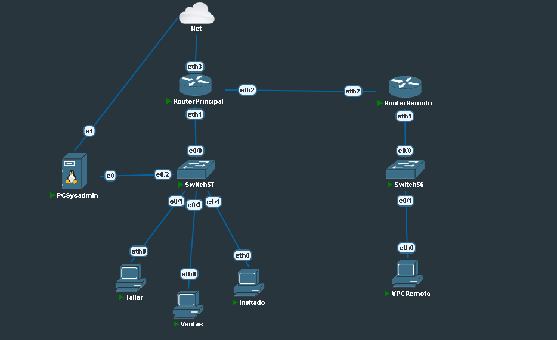

# TP Redes Integrador + Netmiko

## 📌 Descripción del Proyecto

Este trabajo práctico tiene como objetivo **diseñar, implementar y automatizar una red segmentada** utilizando herramientas y protocolos modernos de networking. Incluye:

- **Direccionamiento IPv4 con VLSM/FLSM**
- **VLANs funcionales y de gestión**
- **Router-on-a-Stick (inter-VLAN routing)**
- **Enrutamiento estático entre sedes**
- **Acceso remoto seguro mediante SSH**
- **Automatización de configuraciones con Python (Netmiko)**

Toda la infraestructura se gestiona de forma centralizada desde una **PC Sysadmin (Debian 12)**, permitiendo administrar dispositivos de red Cisco y MikroTik.

---

## 🖥️ Topología de Red



### Componentes Principales

- **Router Principal** (MikroTik)
- **Router Remoto** (MikroTik)
- **Switch Principal** (Cisco Switch57)
- **Switch Remoto** (Cisco Switch56)
- **PC Sysadmin** (Debian 12 + Netmiko)
- **Hosts Finales:** Taller, Ventas, Invitado, VPCRemota

---

## 📑 Plan de Direccionamiento

La red base asignada es **10.10.14.0/24** (bloque de estudiante). Se implementan varias VLANs, cada una con su propia subred y gateway:

| VLAN | Nombre      | Hosts requeridos | Subred asignada   | Gateway           |
|------|-------------|------------------|-------------------|-------------------|
| 250  | Ventas      | 25               | 10.10.14.64/27    | 10.10.14.65       |
| 251  | Técnica     | 14               | 10.10.14.96/28    | 10.10.14.97       |
| 252  | Visitantes  | 6                | 10.10.14.112/29   | 10.10.14.113      |
| 259  | Nativa      | -                | 10.10.14.120/30   | -                 |
| 1499 | Gestión     | 5                | 10.10.14.0/29     | 10.10.14.1-4      |

---

## 🔧 Configuración de Dispositivos

### 🔹 Switch Remoto (Switch56)

```bash
enable
configure terminal

hostname Switch56
enable secret <contraseña-configurada>
username admin secret <contraseña-configurada>
clock timezone -03 -3 0
no ip domain-lookup
ip domain-name midominio.local
ip cef

vlan 1499
 name Gestion
exit

interface Ethernet0/0
 switchport mode access
 switchport access vlan 1499
exit

interface Vlan1499
 ip address 10.10.14.3 255.255.255.248
 no shutdown
exit

ip http server
ip http secure-server
crypto key generate rsa modulus 1024
ip ssh version 2

line con 0
 exec-timeout 0 0
 privilege level 15
 logging synchronous
exit

line aux 0
 exec-timeout 0 0
 privilege level 15
 logging synchronous
exit

line vty 0 4
 login local
 transport input ssh
exit

end
write memory
```

---

### 🔹 Switch Principal (Switch57)

```bash
enable
configure terminal

hostname Switch57
enable secret <contraseña-configurada>
username admin secret <contraseña-configurada>
clock timezone -03 -3 0
no ip domain-lookup
ip domain-name midominio.local
ip cef

vlan 1499
 name Gestion
exit

interface Ethernet0/0
 switchport mode access
 switchport access vlan 1499
exit

interface Ethernet0/2
 switchport mode access
 switchport access vlan 1499
exit

interface Vlan1499
 ip address 10.10.14.2 255.255.255.248
 no shutdown
exit

ip http server
ip http secure-server
crypto key generate rsa modulus 1024
ip ssh version 2

line con 0
 exec-timeout 0 0
 privilege level 15
 logging synchronous
exit

line aux 0
 exec-timeout 0 0
 privilege level 15
 logging synchronous
exit

line vty 0 4
 login local
 transport input ssh
exit

end
write memory
```

---

### 🔹 Router MikroTik Remoto

```shell
/interface bridge
add name=bridge-trunk

/interface bridge port
add bridge=bridge-trunk interface=ether1
add bridge=bridge-trunk interface=ether2

/ip address
add address=10.10.14.4/29 comment=Gestion interface=ether1 network=10.10.14.0

/ip dhcp-client
add interface=ether1

/ip service
set ssh address=10.10.14.0/29
```

---

### 🔹 Router MikroTik Principal

```shell
/interface bridge
add name=bridge-trunk

/interface bridge port
add bridge=bridge-trunk interface=ether2
add bridge=bridge-trunk interface=ether1

/ip address
add address=10.10.14.1/29 comment=Gestion interface=ether1 network=10.10.14.0

/ip dhcp-client
add interface=ether1

/ip service
set ssh address=10.10.14.0/29
```

---

## 🤖 Automatización con Netmiko

Para facilitar la administración y configuración remota, se utiliza **Netmiko** para automatizar tareas sobre equipos Cisco y MikroTik desde la PC Sysadmin.  
Puedes crear un archivo `netmiko_script.py` con ejemplos de conexión y ejecución de comandos automáticos.

### Ejemplo básico de uso

```python
from netmiko import ConnectHandler

cisco_switch = {
    'device_type': 'cisco_ios',
    'ip': '10.10.14.2',
    'username': 'admin',
    'password': 'tu_contraseña',
    'secret': 'tu_enable_secret',
}

net_connect = ConnectHandler(**cisco_switch)
net_connect.enable()
output = net_connect.send_command('show vlan brief')
print(output)
net_connect.disconnect()
```

---

---

## 📝 Licencia y Autor

Trabajo práctico integrador para la materia **Redes y Comunicaciones** - Quiroz Martina.  

---
